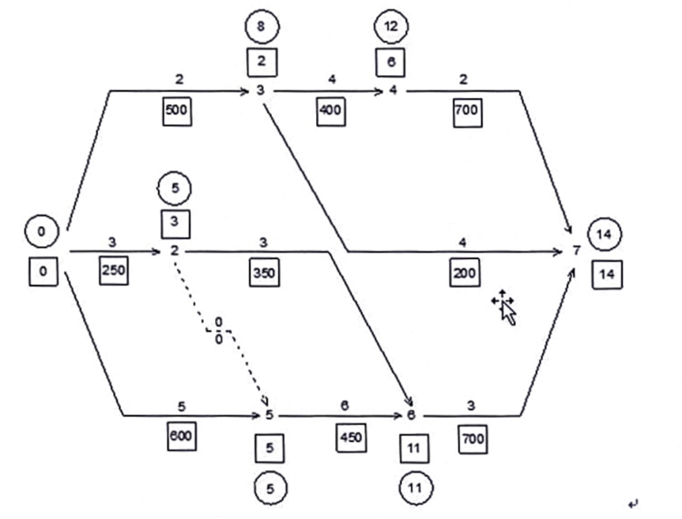

# 案例分析

如图 1 所示的工程项目,每个作业箭线上面的数字是作业持续时间(周),箭线下面方框中的数字是每周的估计费用。

承包商的最初资源储备是 4500 美元，由自有资金投资。同时，他预期将收到下述进度款:在事件 5 收到 1000 美元,在第 8 周收到 5000 美元，在事件 6 收到 5000 美元。承包商应收工程项目款的总额为 16000 美元，在工程项目完工 1 周后收到余额。利用资源分配解这个问题，须注意支出、投资、收到的付款、资源贮备量中的可用额和工程项目时钟。

在案例时，有 2 种可能情形:公司提供资金、借款。每种情形是单独解决。

